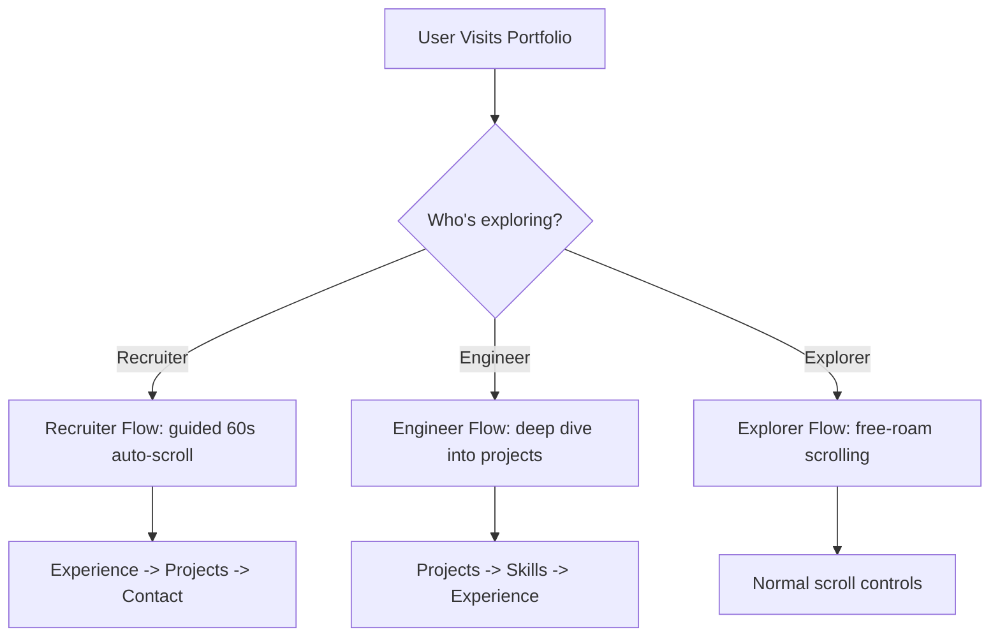

# Product Requirement Document (PRD)
## Deepak Bansal — 3D Engineering Portfolio

---

## 1. Document Control & Metadata

| Title | Deepak Bansal — 3D Portfolio PRD |
| :--- | :--- |
| **Author** | Antigravity AI Coding Assistant |
| **Status** | Approved (Production Ready) |
| **Target Audience** | Technical Recruiters, Software Engineers, Engineering Managers, Tech Enthusiasts |
| **Latest Release** | v1.2 (Netflix-Style Personas & Custom 3D Constellation Nodes) |
| **Key Repositories** | [DevPortfolio](https://github.com/creatorbansal23-source/DevPortfolio) |

---

## 2. Executive Summary & Goals

### 2.1 Problem Statement
In a crowded job market, standard linear text resumes fail to capture the multi-dimensional experience of senior software developers. Specifically, senior engineers working in enterprise architectures (like C#/.NET Core, Azure cloud pipelines, database indexing, and AI automated tooling) need a way to communicate:
- Real architectural impact (performance metrics, uptime, latency reductions).
- Tech-stack depth and interactive component relationships.
- Creative coding abilities (e.g., 3D graphics, motion typography).
- Modular software practices (clean code, automated testing, automated build pipelines).

### 2.2 Product Vision
To build an immersive, dark-themed, high-contrast 3D engineering portfolio that acts as a digital resume, interactive tech-stack demonstration, and communication channel for Deepak Bansal. The portfolio must load fast, remain highly legible across all devices (including screen-size-gated interactive 3D elements), and guide visitors through curated pathways based on their specific goals.

### 2.3 Core Objectives (KPIs)
- **High Engagement**: Keep recruiters on the page with structured persona guides, reducing drop-off.
- **Flawless Responsiveness**: Guarantee a premium experience across mobile, tablet, and ultra-wide desktops.
- **Spam-Safe Communication**: Provide an asynchronous contact pipeline backed by a database to store and list messages.
- **Resilience**: Ensure the client loads successfully even if external API dependencies (such as the GitHub REST API) fail or get rate-limited.

---

## 3. Target Personas & Core Journeys

The site features an **`IntroOverlay`** ("Who's exploring?") modal that locks page scroll and prompts the user to select one of three navigation pathways.

### 3.1 The Technical Recruiter (Guided · 60s Flow)
* **Goal**: Validate professional credentials, key production achievements, and contact details as quickly as possible.
* **Journey**:
  1. Selects "Recruiter" in the `IntroOverlay`.
  2. Page automatically auto-scrolls to **Experience** (showing the Coforge timeline and awards) with smooth step-by-step scrolling (chained `setTimeout`).
  3. Transitions to **Projects** to review shipped applications.
  4. Ends at **Contact** to send a direct message or schedule a call.

### 3.2 The Software Engineer / Tech Lead (Deep Dive Flow)
* **Goal**: Review architecture, code quality patterns, GitHub projects, and exact tech proficiency.
* **Journey**:
  1. Selects "Engineer" in the `IntroOverlay`.
  2. Auto-scrolls to **Projects** (highlighting source code repositories).
  3. Transitions to **Skills** (to play with the interactive 3D constellation and see proficiency scores).
  4. Finishes at **Experience** to inspect the technical stack details.

### 3.3 The Casual Explorer (Freeroam Flow)
* **Goal**: General exploration, checking out UI design aesthetics and interactive animations.
* **Journey**:
  1. Selects "Just exploring" (or clicks "skip intro").
  2. Normal scroll controls are enabled, allowing the user to browse at their own pace.

---

## 4. Core Features & Functional Requirements

The application is structured into 6 sequential sections, plus global utilities:

### 4.1 Intro Overlay & Personas (`IntroOverlay`)
* **Overlay Triggers**: Displays on the first visit of a user. Once chosen, saves the state to `localStorage` (`deepak-portfolio:intro-seen-v1`) to prevent intrusive re-prompts.
* **Manual Replay**: A footer button (`↻ replay intro`) allows users to reset the local storage and re-trigger the persona screen.
* **Scroll Lock**: The browser body scroll is locked (`overflow: hidden`) while the overlay is open and unlocked upon path selection or close.
* **Persona Profiles**:
  * **Recruiter**: Guided 60s flow (`experience` -> `projects` -> `contact`).
  * **Engineer**: Deep-dive flow (`projects` -> `skills` -> `experience`).
  * **Explorer**: Freeroam flow (no auto-scroll).

### 4.2 Hero Section (`Hero` & `HeroScene`)
* **3D Particle Background**: Displays floating 3D geometric nodes (box, octahedron, icosahedron meshes in Three.js) connected by glowing white/red line segments. Rotates slowly, responding dynamically to frames.
* **Viewport Gating**: The 3D R3F Canvas is active and loaded on desktop screen sizes (`lg:` breakpoint and above). On mobile/tablet, it is bypassed for a clean CSS geometric grid background to optimize paint latency and battery life.
* **KPI Metrics Bento**: Highlights key performance stats:
  * Backend throughput (+40%)
  * Uptime delivered (99.9%)
  * End users served (10,000+)
  * Tech debt reduced (-25%)
* **Call-to-Action (CTA)**: Immediate buttons to jump to the contact form, open GitHub, or view the professional experience timeline.
* **Live Status Pill**: Displays pulsing live status tag: `SHIPPING · COFORGE · 2026`.

### 4.3 About Section (`About` & `WhoamiTerminal`)
* **Marquee Ticker**: A continuously cycling, CSS-animated marquee displaying the primary technology tags.
* **Narrative Copy**: Text summarizing Deepak's engineering philosophy, focusing on backend throughput, latency, code longevity, and AI workflow integration.
* **Whoami Terminal**: A simulated terminal component that prints lines sequentially (simulating standard CLI commands like `whoami`, `cat current.role`, `ls stack/`, `echo $LOCATION`, `cat open_to.txt`). Features a blinking console caret.

### 4.4 Skills Section (`Skills` & `SkillsConstellation` & `ContinueWatchingRail`)
* **3D Skills Constellation**: An interactive spherical point cloud representing the technologies. Users can drag/rotate the sphere via `<OrbitControls>`. The core consists of:
  * Perpendicular orbital rings.
  * A wireframe icosphere shell.
  * A faceted octahedron core emitting a red glow.
  * Electron particles orbiting on multiple planes.
  * Breathing tag dots and text connectors.
* **Skill Rail (`ContinueWatchingRail`)**: A Netflix-inspired horizontal, scroll-snap-enabled track highlighting key proficiencies:
  * Backend (C# & .NET Core - 94%)
  * Cloud (Azure Platform - 88%)
  * Data (Cosmos DB & SQL - 82%)
  * AI & Automation (Copilot Studio & AI Foundry - 78%)
  * Frontend (React & TypeScript - 80%)
  * Quality (SonarQube & CI/CD - 90%)
  * Features category tags, custom icons, proficiency indicator bars, and horizontal navigation arrows.

### 4.5 Shipped Projects Section (`Projects`)
* **B brutalist Grid**: Projects mapped onto a 12-column sharp border grid layout.
* **GitHub API Sync**: The list merges static configuration details (such as description and custom stack tags) with live GitHub metrics (Stars, Forks, Languages) using a custom hook (`useGithubRepos`).
* **Graceful Fallback**: If the API call fails, the client uses configured project metadata, preventing broken UI cards.
* **Project Selection**:
  1. *DiagramAI* (Python/AI/Visualization)
  2. *Budget Planner* (TypeScript/React/Charts)
  3. *Car Damage Estimator v2* (HTML/Computer Vision/Web)
  4. *DevPortfolio* (React/Three.js/Framer Motion)

### 4.6 Experience & Awards (`Experience`)
* **Timeline Grid**: A C#/.NET Core experience timeline with a visual connecting line.
* **Top-3 Awards**: Refactored with large, high-contrast background outline numerals (01, 02, 03) and a red `TOP 3` badge:
  1. *PAT On The Back Award* (Coforge, Sep 2025)
  2. *Collaborator Award* (Coforge, Mar 2025)
  3. *Hackathon Winner* (Coforge, Dec 2024)
* **Education Section**: Cards displaying the B.Tech in EECE from SRMS CET.

### 4.7 Contact & Signals (`Contact` & `ContactSignal`)
* **Live Status Signals**: Contains a live status dashboard:
  * Live status pill: `LIVE · OPEN TO WORK`
  * "Now Shipping" focus ticker: cycling through currently shipped architectures.
  * Status list (Reply window, timezone compatibility, best-fit roles).
* **Asynchronous Form**: Connects to the backend POST endpoint to insert name, email, subject, and message.
* **Validation & States**:
  * Real-time field required verification.
  * Email syntax matching.
  * Visual success/failure banners after REST calls.

---

## 5. Non-Functional Requirements (NFRs)

### 5.1 Performance & Resource Tuning
* **Fast Render Cycles**: Minimize Three.js canvas resource footprint by disabling pointer events on the Hero canvas and restricting OrbitControls on the Skills constellation to horizontal rotations.
* **GitHub Rate-Limit Protection**: Cache GitHub REST API responses in-memory for 10 minutes (600s) on the backend server.
* **Frame Budgets**: Clamp device pixel ratio (`dpr={[1, 1.5]}`) on canvases to prevent rendering lag on high-DPI screens.

### 5.2 UI/UX Design System
* **Brutalist Swiss Aesthetics**:
  * Ink black (`#050505`) background, off-black surfaces (`#121212`), white typography.
  * High-contrast Vermilion red (`#FF3B30`) accent.
  * Sharp corners (no border radii) to convey enterprise robustness.
  * Fine 1px border gridlines (`rgba(255,255,255,0.1)`).
  * Subtle SVG-generated film grain overlay.

### 5.3 Technical Compatibility & Responsiveness
* **Tailwind Utility Classes**: Adapt grid configurations (e.g., columns scaling from `col-span-12` on mobile to `col-span-6` on desktop).
* **Cross-Browser Support**: Ensure animation frames and WebGL canvases degrade gracefully on older browsers without throwing breaking exceptions.

---

## 6. Backlog & Roadmap

### P1: Static Assets & Direct Links
* Include the real resume PDF under `public/` and wire the `hero-resume-button` to trigger a direct download.

### P2: Admin Protection & Calendars
* Implement API key authorization (`X-Admin-Key` header) for `GET /api/contact` to prevent unauthorized message listing.
* Integrate an inline calendar scheduling widget (e.g., Cal.com/Calendly) directly inside the Contact dashboard.
* Integrate telemetry scripts (Plausible or PostHog) to track visit-to-contact conversion funnels.

### P3: Interactive Enhancements
* Add modal frames to display project case studies (architectural diagrams, challenges, solutions).
* Wire the tag labels in the 3D Skills Constellation to filter project lists in real-time when clicked.
