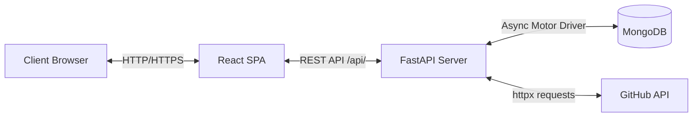

# Technical Requirement Document (TRD)
## Deepak Bansal — 3D Engineering Portfolio

---

## 1. System Architecture Overview

The system follows a classic decoupled 3-tier architecture composed of:
1. **Frontend Client**: React Single Page Application (SPA) utilizing WebGL canvases for 3D visualizations, Tailwind CSS for styling, and Axios for API communications.
2. **Backend API**: Python FastAPI asynchronous server handling route controllers, memory caches, and database client layers.
3. **Database Layer**: MongoDB instance (accessed asynchronously via the Motor driver).



---

## 2. Frontend Technical Specification

### 2.1 Package & Version Manifest
The frontend is built on **React 18** and utilizes the following key dependencies:
* **Core React**: `react` (^18.3.1) and `react-dom` (^18.3.1).
* **3D Viewport Engines**: `three` (^0.169.0), `@react-three/fiber` (^8.17.10), and `@react-three/drei` (^9.114.0).
* **Motion & Animation**: `framer-motion` (^11.11.17).
* **HTTP Client**: `axios` (^1.7.7).
* **Icons**: `lucide-react` (^0.460.0).
* **Build Tooling**: `react-scripts` (5.0.1) with `postcss` and `tailwindcss` (^3.4.15).

### 2.2 WebGL 3D Visualization Modules

#### A. Hero Scene (`HeroScene.js`)
* **Purpose**: Displays a background cluster of floating nodes representing a server node system.
* **Technical Details**:
  * **Layout**: Uses a stable, module-scoped array of Vector3 positions (`NODE_POSITIONS`) to guarantee deterministic positioning.
  * **Edges**: Lines are calculated dynamically on initialization (`buildEdges`) connecting any node pairs whose Euclidean distance is less than `3.2` units.
  * **Meshes**: Renders custom shapes based on node indices (0: Box, 1: Octahedron, 2: Icosphere) using basic metallic/roughness parameters.
  * **Frame Rendering**: Rotates the parent group (`useFrame` delta delta-based step) and fluctuates vertical coordinates with a sine wave modifier.
  * **Responsiveness**: Hooks into browser window resizing. Modifies group scales dynamically: `w < 768px: 0.4`, `w < 1024px: 0.55`, `w >= 1024px: 1.0`.

#### B. Skills Constellation (`SkillsConstellation.js`)
* **Purpose**: A point-cloud sphere of skill text tags orbiting around an atomic core.
* **Technical Details**:
  * **Fibonacci Sphere Distribution**: Distributes skill tags evenly on a sphere of radius `2.4` using the golden ratio spiral:
    $$y = i \cdot \text{offset} - 1 + \frac{\text{offset}}{2}$$
    $$r = \sqrt{1 - y^2}$$
    $$\phi = i \cdot \pi \cdot (3 - \sqrt{5})$$
  * **Core Composition (`PulsingCore`)**:
    * Three thin `<torusGeometry>` orbital rings rotating on distinct axes.
    * A wireframe icosphere shell.
    * A faceted octahedron core mapping a vermilion emissive texture.
    * Three small spheres representing electrons rotating along three perpendicular planes.
    * A central glowing sphere utilizing sine-wave breathing scales.
  * **Interactive Controls**: Utilizes Drei `<OrbitControls>` configured to disable panning, zoom, and vertical rotation angles (`minPolarAngle={Math.PI / 2.6}`, `maxPolarAngle={Math.PI / 1.6}`) to keep the constellation aligned on the screen.

### 2.3 Component & Hook Framework

#### A. Intro Persona Overlay (`IntroOverlay.js`)
* **Persona Profiles**:
  * `recruiter` -> Flow: `['experience', 'projects', 'contact']`
  * `engineer` -> Flow: `['projects', 'skills', 'experience']`
  * `explorer` -> Flow: `null`
* **Auto-Scrolling Mechanism**: Implements sequential auto-scrolling by chaining `scrollIntoView({ behavior: 'smooth', block: 'start' })` with `setTimeout` spacing (700ms initial offset, 3200ms step intervals).
* **Scroll Locking**: Modifies browser DOM properties. Toggles `document.body.style.overflow = 'hidden'` while open to prevent screen scroll bypass.

#### B. Custom Hooks
* **`useGithubRepos`**: Handles fetching repositories from `/api/github/repos` using Axios. Returns `repos` and `loading` states. Cleans up execution states using a local boolean `alive` check inside the `useEffect` closure.
* **`useContactForm`**: Encapsulates form states. Handles payload submissions to `/api/contact` and intercepts Axios error schemas, transforming validation errors (`response.data.detail[0].msg`) into user-facing status indicators.

---

## 3. Backend Technical Specification

### 3.1 Framework & Core Dependencies
The backend API is implemented in **Python 3.8+** using **FastAPI**:
* **Asynchronous Networking**: `fastapi`, `uvicorn`, `httpx` (async HTTP client).
* **Database Driver**: `motor` (asynchronous MongoDB wrapper using `asyncio`).
* **Validation & Serializers**: `pydantic` (V2) for type checking and serialization schemas.
* **Configuration**: `python-dotenv` for local environment management.

### 3.2 Database Serialization Configuration
To map MongoDB's standard `ObjectId` identifiers to Pydantic-compatible JSON fields, the backend uses a custom type:
```python
def _coerce_objectid(v: Any) -> str:
    if isinstance(v, ObjectId):
        return str(v)
    if isinstance(v, str):
        return v
    raise ValueError("Invalid ObjectId")

PyObjectId = Annotated[str, BeforeValidator(_coerce_objectid)]
```
The base schema class implements serialization helpers for inserting and retrieving records:
```python
class BaseDocument(BaseModel):
    model_config = ConfigDict(populate_by_name=True, arbitrary_types_allowed=True)
    id: Optional[PyObjectId] = Field(default=None, alias="_id")

    def to_mongo(self) -> dict:
        data = self.model_dump(by_alias=True, exclude_none=True)
        data.pop("_id", None)
        return data
```

### 3.3 Endpoint Specification
All routes are registered on an `APIRouter` prefixed with `/api`.

#### 1. Root & Health Check
* **`GET /api/`**: Returns service details and ownership verification.
* **`GET /api/health`**: Executes an asynchronous `db.command("ping")` command to verify database connectivity. Returns `503 Service Unavailable` if MongoDB is unreachable.

#### 2. Profile Fetch
* **`GET /api/profile`**: Serves profile data (experiences, certifications, education, projects, skills). Done statically on the backend to avoid database read overhead.

#### 3. GitHub Cache Proxy
* **`GET /api/github/repos`**:
  * **Cache Policy**: Stores responses in a global dictionary cache `_GH_CACHE` with a 10-minute (600s) threshold.
  * **Rate Limit Fallback**: If the GitHub REST API rejects the client request or is rate-limited, the endpoint catches the exception and returns curated projects from the static profile array.

#### 4. Contact Form Processing
* **`POST /api/contact`**:
  * **Request Validation**: Enforces string length constraints (`name`: 1-120 chars, `message`: 1-4000 chars) and validates emails using Pydantic's `EmailStr`.
  * **Database Insertion**: Inserts documents into the database asynchronously. Appends an ISO UTC timestamp. Returns status code `201 Created` along with the newly generated record ID.
* **`GET /api/contact`**:
  * **Retrieval**: Returns contact form submissions sorted by `created_at` descending, capped at a limit of 100 entries.

---

## 4. Database Schema Specification

The application uses a database defined by the environment variable `DB_NAME` containing the following collections:

### 4.1 Collection: `contact_messages`
Stores contact messages submitted by users.

```json
{
  "_id": "60c72b2f9b1d8b2a5c8e4d3f",
  "name": "Jane Doe",
  "email": "jane.doe@example.com",
  "subject": "Collaboration Opportunity",
  "message": "We would like to discuss a senior engineering role...",
  "created_at": "2026-06-13T20:00:42.123456+00:00"
}
```

#### Fields:
* `_id` (`ObjectId`): Primary key.
* `name` (`String`): Sender's name.
* `email` (`String`): Verified email address.
* `subject` (`String | Null`): Optional subject line.
* `message` (`String`): Message body.
* `created_at` (`String`): ISO 8601 UTC timestamp.

---

## 5. Testing & Environment Configurations

### 5.1 Test Framework (`tests/test_portfolio_api.py`)
Integration testing is implemented with **pytest** and executes HTTP requests using `requests.Session`:
* **Health Check Suite**: Verifies `/api/health` returns database connectivity statuses.
* **Profile Shape Tests**: Validates profile payload structures, count assertions for arrays (4 stats, 4 projects, 2 experiences, 3 awards, 4 skill divisions).
* **GitHub API Verification**: Validates response structure.
* **Contact Validation**:
  * Simulates valid message POSTs and verifies data matches in MongoDB via `GET /api/contact`.
  * Verifies email format validations return status code `422 Unprocessable Entity`.
  * Verifies missing field exceptions return status code `422 Unprocessable Entity`.

### 5.2 CORS Configuration
The backend configures cross-origin security headers using FastAPI's `CORSMiddleware` to allow frontend requests:
```python
app.add_middleware(
    CORSMiddleware,
    allow_origins=["*"],
    allow_credentials=True,
    allow_methods=["*"],
    allow_headers=["*"],
)
```
*(Note: To restrict access in staging/production, wildcards should be replaced with explicit host origins).*
